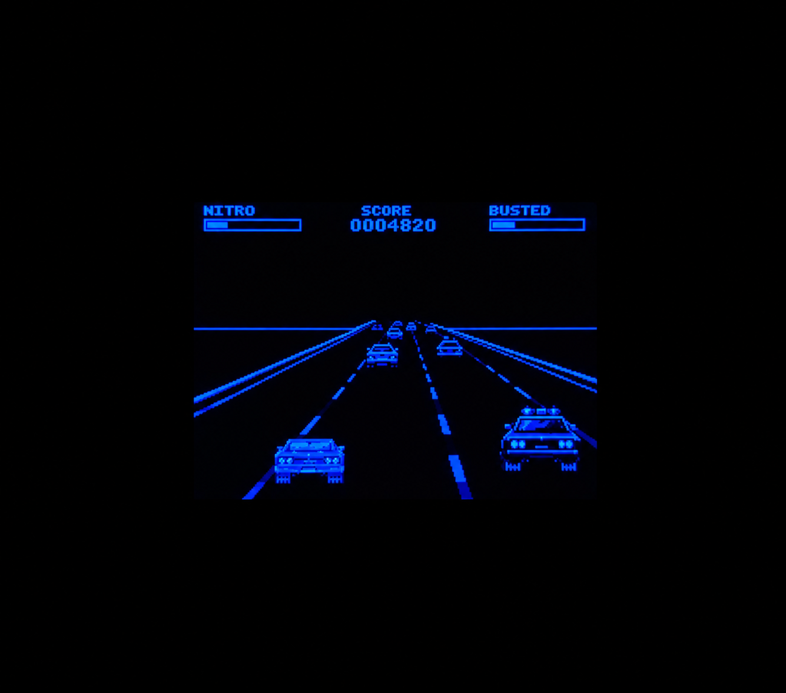
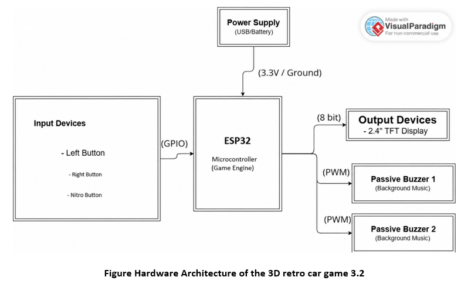
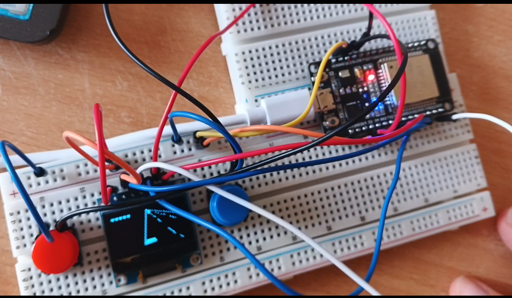
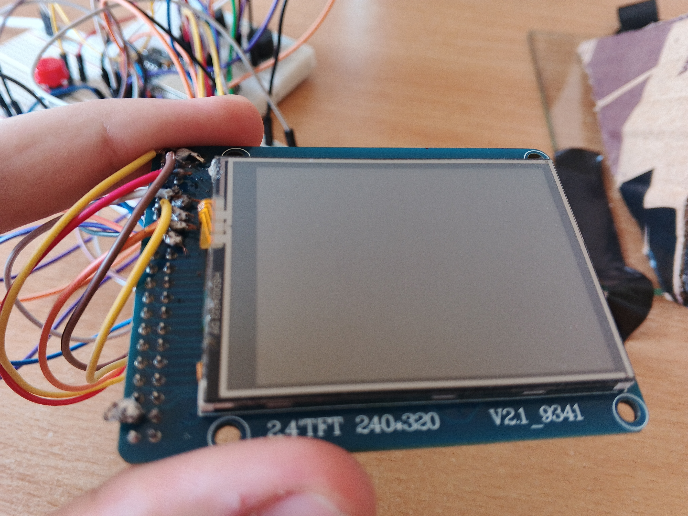
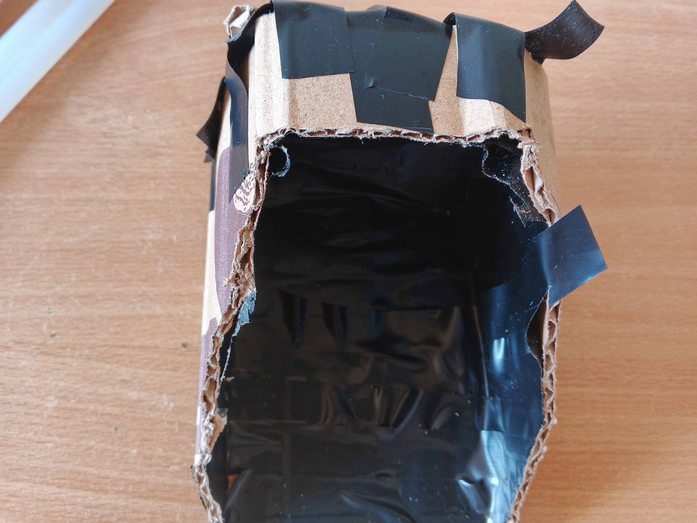
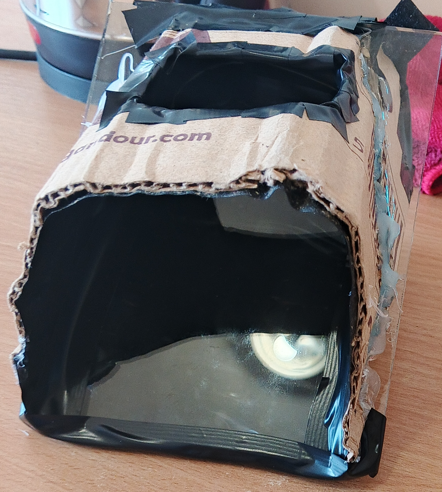
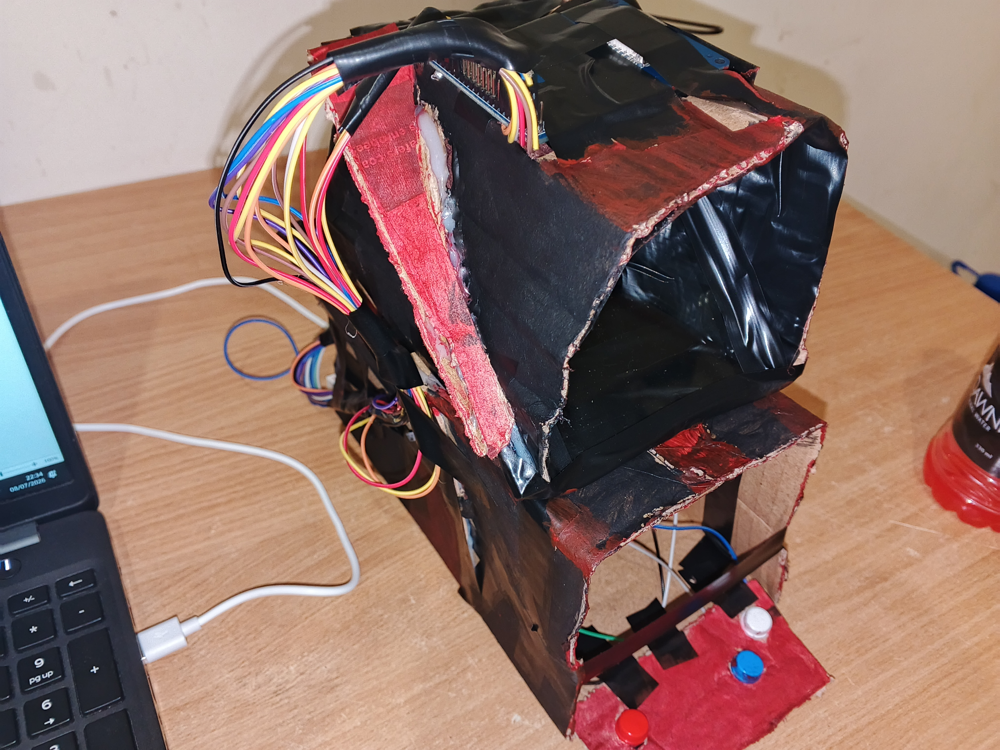
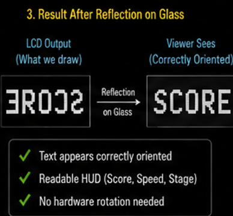

# Neo-OutRun: Holographic Pseudo-3D Racing Engine



Neo-OutRun is a custom-built, retro arcade racing console powered by an ESP32. It utilizes a 2.4" TFT display, high-speed 8-bit parallel data rendering, and a physical optical cabinet to create a "Pepper's Ghost" holographic illusion. 

This project was built from scratch in C++ without the use of dedicated graphics processing units (GPUs) or external game engines.

[https://www.youtube.com/watch?v=33OQNa7OZd0](https://www.youtube.com/watch?v=33OQNa7OZd0)
*(Click for a full hardware breakdown and gameplay demo!)*

## 🚀 Features
* **Pseudo-3D Projection Math:** Real-time Z-depth scaling and perspective rendering on a microcontroller.
* **Holographic Cabinet:** A custom cardboard chassis utilizing a 45-degree glass pane to project the screen into mid-air.
* **Custom Mirrored Font Engine:** A 5x7 ASCII bitmap font stored in `PROGMEM` that renders right-to-left to optically correct the mirror inversion.
* **Dual-Channel Embedded Audio:** Non-blocking `millis()` audio engine running concurrent background engine sounds and high-priority collision SFX.
* **Dynamic AI & Escalation:** Deterministic state machines control civilian traffic, police pursuit logic, and difficulty multipliers at 60 FPS.

---

## 🛠️ The Hardware Architecture



The ESP32 acts as the core central processing unit. Player inputs trigger state changes, driving the parallel interface to output high-resolution frames while simultaneously utilizing PWM pins to run non-blocking, multi-channel audio on dual passive buzzers.

### Phase 1: The SPI Bottleneck

The engine was initially prototyped on a 0.96" OLED using an SPI interface. While it validated the core game loop, the serial SPI bus bottlenecked the frame rate, proving insufficient for smooth 3D rendering.

### Phase 2: The 8-Bit Parallel Upgrade

To achieve a stable 60 FPS, the system was migrated to a 2.4" ILI9341 TFT display driven via a hardware 8-bit parallel bus (`D0-D7`). This slashed data transmission overhead by 75% per frame compared to SPI.

### Phase 3: The Holographic Cabinet


To emulate a true arcade experience, the screen was mounted face-down inside a light-blocking enclosure. A 4mm pane of glass was installed at exactly 45 degrees, reflecting the TFT's light toward the player to create a floating "Pepper's Ghost" illusion.



---

## 💻 Software Architecture Highlights

### Defeating Optical Inversion (The Custom Font Engine)



Because the 45-degree mirror horizontally inverts the screen, standard text becomes unreadable. Instead of using CPU-heavy global screen rotation matrices, we wrote a custom drawing loop that reads pixel columns from Flash memory and mathematically renders them backward across the screen. When reflected in the glass, the two inversions cancel out, rendering perfectly readable glowing text.

```cpp
// MIRROR EFFECT: Draw columns from right-to-left inside the character bound
for (int col = 0; col < 5; col++) {
  uint8_t line = pgm_read_byte(&(Font5x7[idx][col]));
  for (int row = 0; row < 7; row++) {
    if (line & (1 << row)) {
      gfx->fillRect(x + (4 - col) * scale, y + row * scale, scale, scale, color);
    }
  }
}
```

## Pseudo-3D Perspective Projection

The road geometry bypasses 3D hardware limits by using simple perspective division to scale Z-depth onto a 2D plane:

```cpp
float perspective = (float)(y - HORIZON) / (SCREEN_H - HORIZON);
float zDist = Z_PROJ_SCALE / perspective;
float roadWidth = perspective * SCREEN_W * 2.2;
```

## 🔌 Hardware Wiring (ESP32)

| Component | ESP32 Pin | Note |
|---|---:|---|
| TFT D0-D7 | 12, 13, 14, 15, 25, 26, 21, 22 | 8-Bit Parallel Bus |
| TFT WR | Pin 2 | Write Clock |
| TFT DC | Pin 4 | Data/Command |
| Buzzer (SFX) | Pin 16 | PWM Output |
| Buzzer (BGM) | Pin 17 | PWM Output |
| Steering (L/R) | Pins 27, 32 | Pull-up Input |
| Nitro Button | Pin 33 | Pull-up Input |

## 📚 Documentation & Authors

For a deep dive into the system requirements, state machines, and optical physics, please see the full academic report in the `/docs` folder.

**Authors:** Imad Albekai (@imadalbekai) & Mohamad Issa

**Course:** Communication & Mini-Project (Lebanese University - Faculty of Engineering III)
